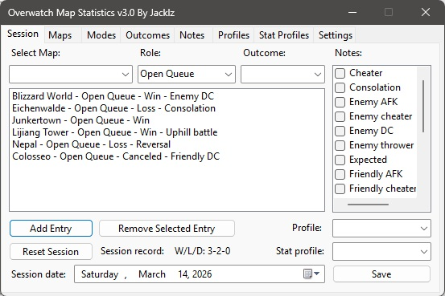
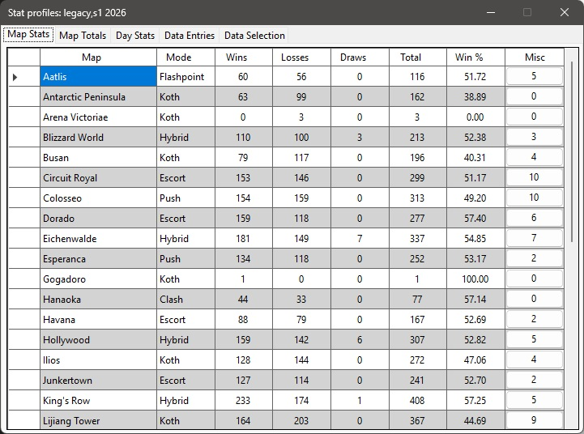

I made the first version of this program way back in 2018 when I was curious about my map winrates. 
I have iterated on it several times over the years and am now making it public.

## Program Features:
- Track your wins/losses/draws and more on any map in Overwatch.
- Save session data to specified 'profiles' and 'stat profiles'
- View saved map data.
- Create 'stat profiles' (season 1 2026, season 2 2026, etc...) to neatly save data to its own file for future review.
- Create 'profiles' to separate multiple accounts (main account, alt account, 5v5, 6v6).
- Add new maps and game modes with ease when new content comes out.
- Export stats with the click of a button to a .CSV file ready to import to google sheets or similar programs.
- Easily display the current session's record on OBS by adding a new text file source.

## Images

